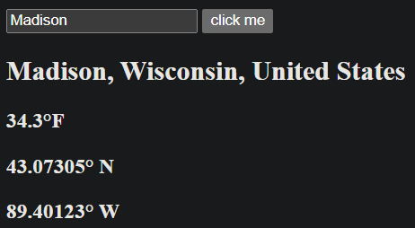

# Weather App

A weather app to display the latitude, longitude, temperature, and weather condition of a city using the [`open-meteo`](https://open-meteo.com/) API.

## What it boils down to...
- [x] Fetch data from the `API`
- [x] Render the results of the `API`

## Level 1
- [x] Fetch data with a hard-coded query from the `API` 
- [x] Print the results to the `console`

<picture>
    
</picture>

## Level 2
- [x] Add a `form` that takes in a city to pass into the `API`
- [x] Display the results to an `HTML element`

<picture>
    
</picture>

<picture>
    
</picture>

## Level 3
- [x] Allow the most recent city to saved to local memory
- [] Style the page

<picture>
    
</picture>

<picture>
    
</picture>
